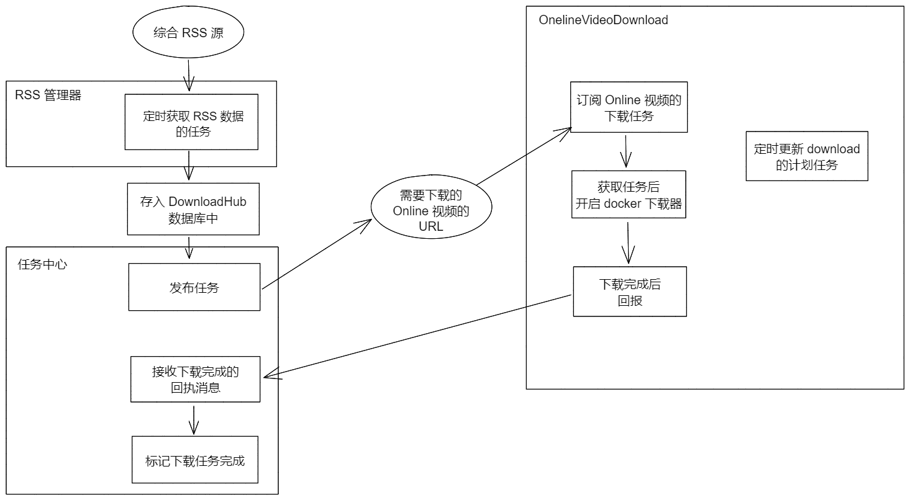

# onlineVideoDl 设计

这个服务，目标是完成在线视频的下载，依赖的是外部是下载器（youtube-dl 或者其他）。为了后续的使用和维护，将使用 ssh 开启额外的 docker 下载器（比如，youtube-dl 的docker）来下载。

如下图：

那么这里就涉及了三个部分：

* OnelineVideoDownload（本模块）
* RSS 管理器（见外部设计文档）
* 任务中心（见外部设计文档）

## 功能描述

### 支持设置代理

因为很可能下载的视频是需要代理的，所以需要传递代理的参数给到 docker 中。

### 多下载器支持

这里指的是，除了 youtube-dl ，还可能有其他的下载器。其实都是封装到 docker 来用，所以就是输入的 cmd 的差异。

### 下载器的自动更新

这个也是用 cmd 去完成的，所以也是外部的通用执行 cmd 。

### 下载任务的订阅与回报

这里将用到 go-zero 的 go-queue 来实现。比较重要的是“任务中心”的实现。

这里还有一种情况就是失败也需要回报，具体需要再“任务中心”设计的时候考虑

### 同时多个下载器启动

理论上可以支持，不过意义不大，一次一个差不多了。