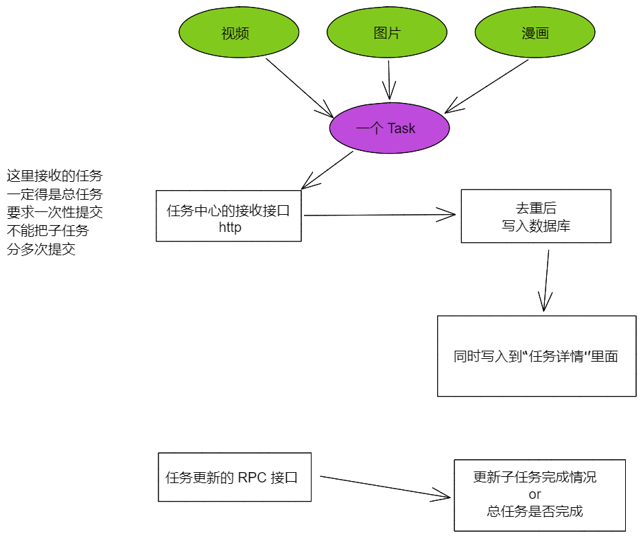
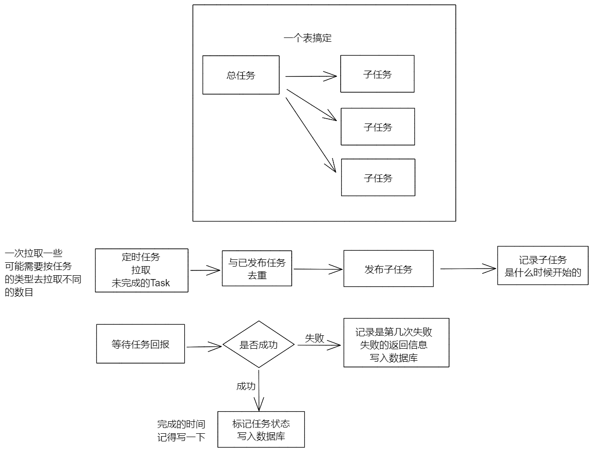
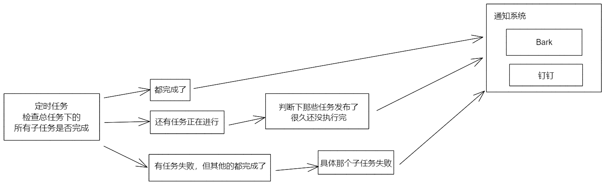

# taskCenter 设计

在 DoanloadHub 中，不管是下载在线视频、BT、漫画，其实都可以理解为是一个任务。那么就需要发布任务给执行者（具体的下载器），然后下载完毕或者失败的时候需要回报。然后通知使用者有问题了，同时也记录到日志中，方便后续的查看。

首先，任务是去数据库拿取的，然后再进行发布。完成后需要标记数据库中的任务已经完成。

## 任务

任务组成：这里举个例。

比如你现在有一个漫画需要下载，那么每一话是一个总任务，然后一话里面的一页就是子任务。

任务需要有状态：

* 未完成		   1
* 正在执行        2
* 完成               3
* 失败               4 （多次尝试后，标记失败）

任务的数据结构：

* 总任务 ID
* 子任务 ID
* 子任务总数
* 当前是第几个子任务
* 任务的内容
* 备注
* 任务的状态
* 创建时间
* 发布时间
* 完成时间
* 错误次数

## 数据库结构

简单画一下先，后续需要给出 DDL 结构。

## 模块拆分

这个子系统会拆分为两个部分：

* 任务总览
* 任务详情
* 任务状态监控：监控任务总览、任务详情

### 任务总览

这个是永久记录用的，为了便于在接收任务的时候进行去重。

### 任务详情

一个总任务下面有多少个子任务，每个子任务的状态是什么。

### 任务状态监控

