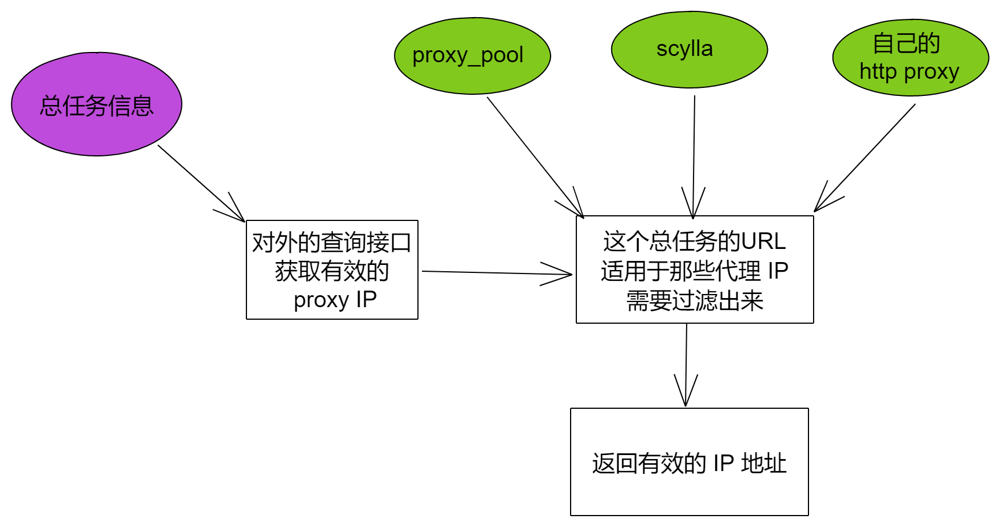

# 03.proxyHub 设计

这里肯定不是自己去做一个代理的爬虫什么的，而是用现成的。那么现在看了两个项目：

* ### [jhao104 / proxy_pool](https://github.com/jhao104/proxy_pool)

* ### [imWildCat / scylla](https://github.com/imWildCat/scylla)

他们可以去爬免费的代理，然后统一下吧他们的 get proxy 的接口给整合起来，过滤以下再使用。

当然，本地还有自己的 http 代理的，所以一种有三个源。

## 自己的 http proxy

现在是使用额外的 V2Ray 共享 http 代理出来使用的，后续可能考虑写个接口，允许选择（切换）最佳的下载服务器。