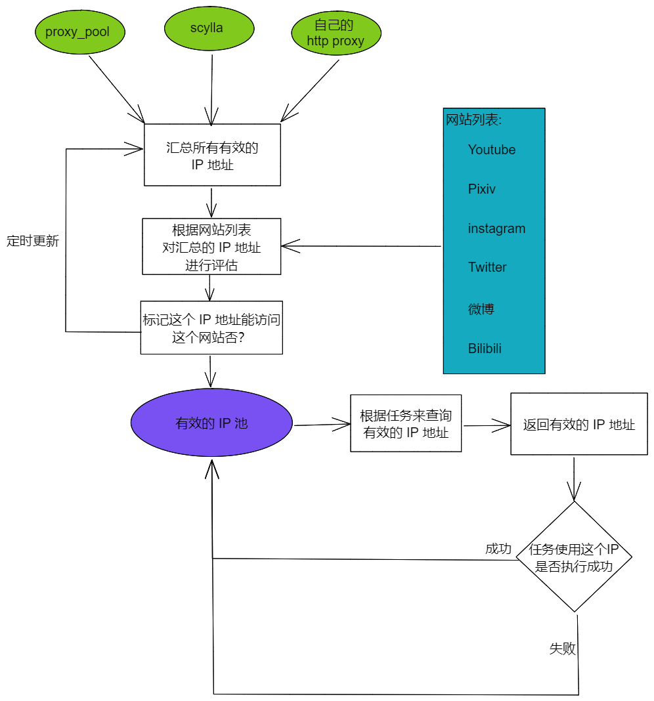

# 03.proxy-hub 设计

## 自己的 http proxy

现在是使用额外的 V2Ray 共享 http 代理出来使用的，后续可能考虑写个接口，允许选择（切换）最佳的下载服务器。

## 第三方的代理池

这里肯定不是自己去做一个代理的爬虫什么的，而是用现成的。那么现在看了两个项目：

* ### [jhao104 / proxy_pool](https://github.com/jhao104/proxy_pool)

* ### [imWildCat / scylla](https://github.com/imWildCat/scylla)

他们可以去爬免费的代理，然后统一下吧他们的 get proxy 的接口给整合起来，过滤以下再使用。

当然，本地还有自己的 http 代理的，所以一种有三个源。

## 数据结构

代理的源：

* proxy_pool
* scylla
* self

单个代理的信息，ProxyInfo：

* SourseID，代理的源
* URL，代理的地址
* HTTP  / HTTPS
* AliveStatus，有效状态
  * 对应网站（域名）的访问统计，成功次数/总次数
  * 对应网站（域名）的访问统计，成功次数/总次数
  * ...

每个网站对应的能够访问的代理地址列表：

* 对应网站（域名）
  * ProxyInfo
  * ProxyInfo
  * ...
* 对应网站（域名）
  * ProxyInfo
  * ProxyInfo
  * ...

接口：

