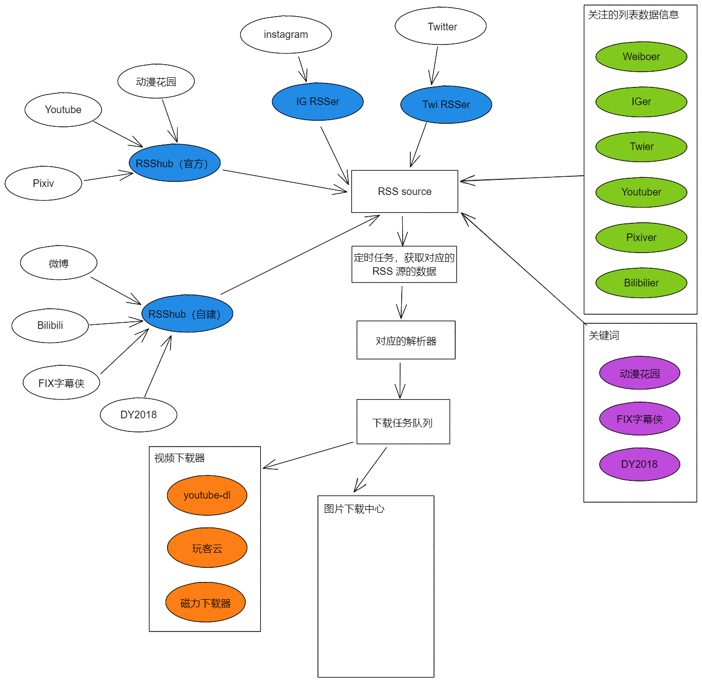
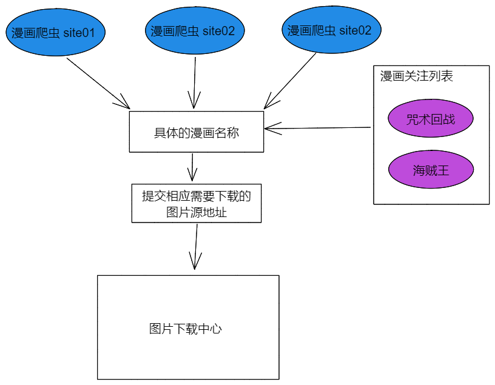

# Downloadhub

开局全靠一张图，之前做的推倒重来 :stuck_out_tongue:

完整的设计过程和代码都会在这更新，只打算写中文文档（也许到某个版本后再考虑翻译）。文档会根据开发遇到的情况调整。

## 目的

个人有下载收藏的癖好，目的是打造家庭的下载中心。个人的下载需求有以下几种：

* 某些视频网站 up 主的视频
* 追剧（美剧、日剧、国产剧、动画）
* 想看的电影或者关注的某些电影
* 追漫画，收藏漫画
* 某些网站 up 主发布的图片

## 之前遇到的问题

断断续续又写过一些程序去完成做，但是没有很好的整合起来。也遇到了不少麻烦的地方：

* 特定网站的资源抓取，需要持续跟踪，失效了得自己修复
* 特定资源的下载也需要对应的下载器，也需要去维护
* 没有统一的资源管理入口
* 没有统一的结果反馈出口

### 解决方案

* 使用 RSS 去订阅资源，依赖 RSSHub 类似的项目
* 使用 youtube-dl 类似的在线视频下载器
* 需要自己写
* 需要自己写

同时，会根据实际的情况，选择 python 或者是 go 来完成对应的模块。比如倾向于 python 做爬虫，go 做后端。vue 做前端。

## 整体设计图

这个会根据实际遇到的问题和解决方案更新。

### 基于 RSS 订阅的下载

这样做的目的，还是把跟多的订阅的更新事情交给专业（RSShub）的做，而他们遇到问题的部分，再自己编码实现，比如 IG 和 Twi 这两个部分。

### 基于爬虫的漫画下载

这里会实现几个网站的爬虫，或者找对应网站的爬虫，不限于 go 或者是 python 的，优先后者。

## 分模块设计

这里会根据当前正在做的模块进行文档输出，可能会再某个模块设计的时候进行其他模块的调整。

### 01.onlineVideoDl 设计

[onlineVideoDl 设计](https://github.com/allanpk716/download-hub/blob/master/DesignFiles/01.onlineVideoDl%20%E8%AE%BE%E8%AE%A1/readme.md)

### 02.taskCenter 设计

[onlineVideoDl 设计](https://github.com/allanpk716/download-hub/blob/master/DesignFiles/02.taskCenter%20%E8%AE%BE%E8%AE%A1/readme.md)

### 03.proxyHub 设计

[proxyHub 设计](https://github.com/allanpk716/download-hub/blob/master/DesignFiles/03.proxyHub%20%E8%AE%BE%E8%AE%A1/readme.md)

## 使用到的框架和库

* [go-zero](https://github.com/tal-tech/go-zero)
* [goinsta](https://github.com/ahmdrz/goinsta)
* [twitter-scraper](https://github.com/n0madic/twitter-scraper)
* [feeds](https://github.com/gorilla/feeds)

等等。